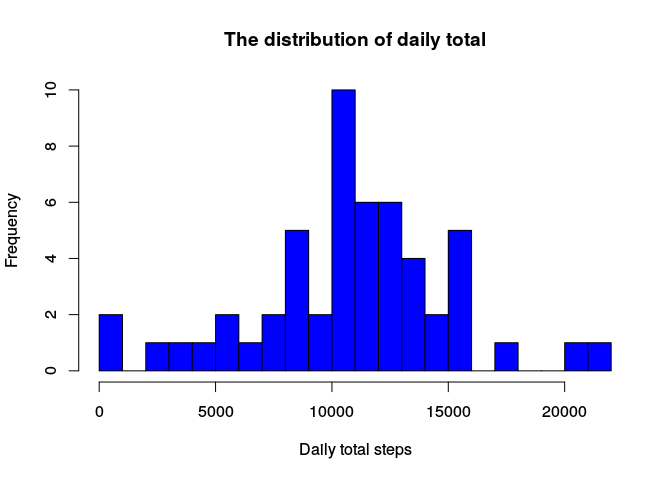
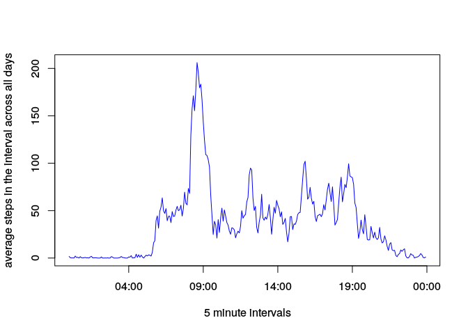
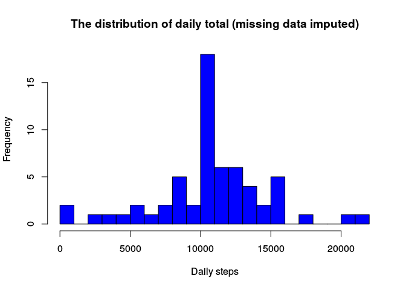
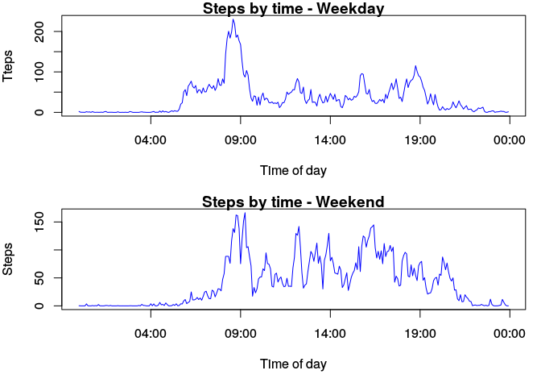

# Reproducible Research: Peer Assessment 1


## Loading and preprocessing the data
The next code is needed to load the libraries used for this document.

```r
library("dplyr")
```

```
## 
## Attaching package: 'dplyr'
```

```
## The following objects are masked from 'package:stats':
## 
##     filter, lag
```

```
## The following objects are masked from 'package:base':
## 
##     intersect, setdiff, setequal, union
```

The data to work exist in the Github repository, this data will be loaded in the "activity" variable.


```r
activity <- read.csv(unz("activity.zip", "activity.csv"), quote = "\"")
head(activity)
```

```
##   steps       date interval
## 1    NA 2012-10-01        0
## 2    NA 2012-10-01        5
## 3    NA 2012-10-01       10
## 4    NA 2012-10-01       15
## 5    NA 2012-10-01       20
## 6    NA 2012-10-01       25
```

Convert all times to POSIXct for simplicity.


```r
activity <- transform(activity, 
                      datetime = strptime( paste(date,formatC(interval,width=4,flag="0")), "%Y-%m-%d %H%M"),
                      timeofday = strptime( paste("1970-01-01",formatC(interval,width=4,flag="0")), "%Y-%m-%d %H%M"))
head(activity)
```

```
##   steps       date interval            datetime           timeofday
## 1    NA 2012-10-01        0 2012-10-01 00:00:00 1970-01-01 00:00:00
## 2    NA 2012-10-01        5 2012-10-01 00:05:00 1970-01-01 00:05:00
## 3    NA 2012-10-01       10 2012-10-01 00:10:00 1970-01-01 00:10:00
## 4    NA 2012-10-01       15 2012-10-01 00:15:00 1970-01-01 00:15:00
## 5    NA 2012-10-01       20 2012-10-01 00:20:00 1970-01-01 00:20:00
## 6    NA 2012-10-01       25 2012-10-01 00:25:00 1970-01-01 00:25:00
```

## What is mean total number of steps taken per day?
###1. Calculation the total number of steps taken per day.
To obtain this information we will create from the data "activity" a variable "stepsperday" after that the mean and median will be calculated.


```r
stepsperday <- aggregate( steps ~ date, data=activity, FUN=sum)
```

###2.- Histogram of the total number of steps taken each day.

Now we are ready to display a histogram about this behavior.


```r
hist(x=stepsperday$steps,
     col="blue",
     breaks=20,
     xlab="Daily total steps",
     ylab="Frequency",
     main="The distribution of daily total")
```

<!-- -->

###3.- Calculation of the mean and median of the total number of steps taken per day.


```r
aMean <- format(round(mean(stepsperday$steps), 2), nsmall = 2)
aMean
```

```
## [1] "10766.19"
```

```r
aMedian <- median(stepsperday$steps)
aMedian
```

```
## [1] 10765
```

The mean is 10766.19 and the median is 10765.

## What is the average daily activity pattern?
###1.- Time series plot.
In this case the data will transform to produce a plot based on interval time.


```r
avgstepspertime <- aggregate( steps ~ timeofday , data = activity, FUN = mean)
```

We are ready to show the plot based on interval time.


```r
plot(avgstepspertime$timeofday,
     avgstepspertime$steps,
     col = "blue",
     type="l",
     xlab="5 minute intervals",
     ylab="average steps in the interval across all days")   
```

<!-- -->

###2.- 5-minute interval that contains the maximum number of steps.


```r
max <- avgstepspertime[which.max(avgstepspertime$steps),]
max
```

```
##               timeofday    steps
## 104 1970-01-01 08:35:00 206.1698
```

In the interval time 08:35:00 the maximum number of steps is very close to 206.

## Imputing missing values
###1.- Calculation of the total number of missing values in the dataset.

Firstly we will calculate the total number of missing values in the set.


```r
missing <- sum(is.na(activity$steps))
missing
```

```
## [1] 2304
```
There are 2304 missing values. 

###2.- Strategy for filling in all of the missing values in the dataset.

The method to imput the values is by assigning the average number of steps for each interval into those intervals with NA's. With the imputed missing values a histogram will be created and will be calculated a mean and median just like before.

###3.-Creation of a new dataset that is equal to the original dataset but with the missing data filled in.


```r
activity.filled <- inner_join(activity,avgstepspertime,by="timeofday")
missing.values <- is.na(activity.filled$steps.x)
activity.filled$steps.x[missing.values] <- activity.filled$steps.y[missing.values]
activity.filled <- transform(activity.filled,
                             steps = steps.x,
                             steps.x=NULL,
                             steps.y=NULL)
stepsperday.filled <- aggregate( steps ~ date, data = activity.filled, FUN = sum)
```

###4.- Histogram and analysis of the new dataset.

Now we are ready to display the histogram. 


```r
hist(x=stepsperday.filled$steps,
     col="blue",
     breaks=20,
     xlab="Daily steps",
     ylab="Frequency",
     main="The distribution of daily total (missing data imputed)")
```

<!-- -->


```r
iMean <- format(round(mean(stepsperday.filled$steps), 2), nsmall = 2)
iMean
```

```
## [1] "10766.19"
```

```r
iMedian <- format(round(median(stepsperday.filled$steps), 2), nsmall = 2)
iMedian
```

```
## [1] "10766.19"
```

The new mean is 10766.19 and the new median is 10766.19. Making a comparision with the original mean and median (10766.19 and 10765) we can see than the mean does not change and the median has only a small change. The impact of imputing missing data on the estimates of the total daily number of steps is that now we have higher frequency counts in the histogram at the center region.

## Are there differences in activity patterns between weekdays and weekends?
###1.- Creation of a new factor variable.

We will create a factor variable for whether each day is part of the weekend or not. Then aggregate based on the time of day and the weekend to get a separate time series of steps for weekends and weekdays.


```r
weektype <- with(activity.filled, 
                ifelse( weekdays(datetime) %in% c("sábado","domingo"),"weekend","weekday"))
activity.filled$weektype <- factor(weektype)
steps.bywknd <- aggregate( steps ~ weektype + timeofday, data=activity.filled,FUN = mean)
```

###2.- Creation of a panel plot.


```r
w <- subset(steps.bywknd, weektype == "weekday")
we <- subset(steps.bywknd, weektype == "weekend")
par(mfrow = c(2, 1), mar = c(5, 4, 1, 1))
plot(w$timeofday,
     w$steps,
     ylab = "Tteps",
     xlab = "Time of day",
     main = "Steps by time - Weekday",
     col = "blue",
     type="l")
plot(we$timeofday,
     we$steps,
     ylab = "Steps",
     xlab = "Time of day",
     main = "Steps by time - Weekend",
     col = "blue",
     type="l")
```

<!-- -->

We can see a difference between weekend and weekday patterns. We can see that this subject wakes up around 6 am on weekdays and takes a regular walk around 8:30. On weekends, the subject rises a bit later. In addition in the weekend we can appreciate an increment in the number of steps on different times, due maybe because the people has more free time.
